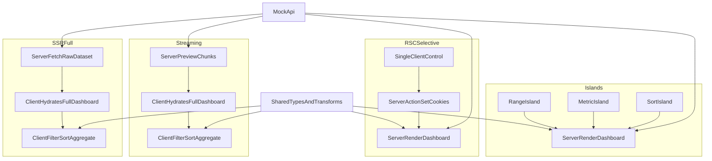

# Исследование адаптивных стратегий рендеринга и выборочной гидратации

Монорепозиторий для сравнения четырех стратегий рендеринга в `Next.js 15 / React 19` на одинаковом UI, но с разными границами гидратации и разным местом выполнения тяжелых преобразований данных.

Основной сценарий для сравнения: `/dashboard`.

## Структура

- `packages/shared` — общие типы, компоненты, data/transforms, API helpers.
- `apps/mock-api` — отдельный backend с большими datasets и управляемой задержкой.
- `apps/ssr-full` — baseline с полной клиентской гидратацией.
- `apps/streaming` — тот же heavy client-side сценарий, но с real `Suspense`/streaming.
- `apps/rsc-selective` — серверный дашборд + маленький client control через server action.
- `apps/islands` — серверный дашборд + три lazy-loaded islands.

## Data Flow



## Конфигурации

### `apps/ssr-full`

- Сервер получает `raw` dataset из `mock-api`.
- Весь дашборд отдается в один большой client component `DashboardInteractive`.
- Фильтры, сортировка, агрегация и expensive transforms выполняются в браузере.
- Это baseline для сравнения INP и клиентской нагрузки.

### `apps/streaming`

- Данные также приходят как `raw` dataset.
- Есть несколько `Suspense`-границ: раннее серверное превью, затем тяжелый hydrated dashboard, затем вторичный инсайт.
- Клиентская нагрузка близка к `ssr-full`, но ранний рендер лучше за счет стриминга.

### `apps/rsc-selective`

- Сервер получает уже агрегированный `view` из `mock-api`.
- Карточки, график и activity list — server-rendered.
- Гидратируется только маленький `ControlsClient`.
- Обновление фильтров идет через `server action` + cookies + revalidation, без `router.replace`.

### `apps/islands`

- Сервер также получает агрегированный `view`.
- Контролы разбиты на три независимых islands:
  - `RangeIsland`
  - `MetricIsland`
  - `SortIsland`
- Islands грузятся через `dynamic(..., { ssr: false })` внутри клиентского контейнера `DashboardIslands`.
- Для уменьшения визуальных рывков заданы фиксированные placeholder’ы и минимальная высота контейнера.

## Shared Layer

Ключевые файлы:

- `packages/shared/src/data/dashboard.ts`
- `packages/shared/src/utils/dashboardView.ts`
- `packages/shared/src/api/mockApi.ts`
- `packages/shared/src/server.ts`
- `packages/shared/src/client.ts`

Что внутри:

- `generateLargeDashboardDataset()` генерирует большие deterministic datasets.
- `applyDashboardView()` строит `view model` из `raw` данных.
- `fetchRawDashboardDataset()` и `fetchDashboardViewFromApi()` дают единый доступ к `mock-api`.
- `@cwr/shared/server` и `@cwr/shared/client` разнесены, чтобы не смешивать server/client exports в Next 15.

## Mock API

`apps/mock-api` поднимает отдельный backend на `http://localhost:4010`.

Маршруты:

- `GET /health`
- `GET /api/dashboard/raw?points=5000&activities=5000&delayMs=150`
- `GET /api/dashboard/view?points=5000&activities=5000&range=7d&metric=users&sort=newest`
- `GET /api/products?count=1200&limit=60`
- `GET /api/products/:id`

## Почему build идет в compile-режиме

Для `Next 15.5.x + React 19` в этом монорепо воспроизводится известная ошибка prerender служебных страниц (`/404`, `/500`) при обычном `next build`, поэтому для benchmark pipeline зафиксирован обходной путь:

```bash
next build --experimental-build-mode compile
```

Именно он используется в scripts каждого Next-приложения.

## Запуск

### Development

```bash
npm install

npm run dev:mock-api
npm run dev:ssr-full
npm run dev:streaming
npm run dev:rsc-selective
npm run dev:islands
```

### Production-style build

```bash
npm run build -w @cwr/shared
npm run build:mock-api
npm run build -w apps-ssr-full
npm run build -w apps-streaming
npm run build -w apps-rsc-selective
npm run build -w apps-islands
```

## Bundle Analysis

```bash
npm run analyze:ssr-full
npm run analyze:streaming
npm run analyze:rsc-selective
npm run analyze:islands
```

Отчеты analyzer’а полезнее route table из `compile`-сборки, потому что показывают реальную разницу по гидратируемым чанкам.

## Lighthouse Measurement

Есть готовый orchestration-скрипт:

```bash
npm run measure:ssr-full
npm run measure:streaming
npm run measure:rsc-selective
npm run measure:islands
```

Что делает `scripts/measure.mjs`:

- стартует `mock-api`
- стартует выбранное приложение
- ждет readiness через `wait-on`
- запускает `lighthouse` для `/dashboard`
- сохраняет JSON-отчеты в `reports/<app-name>/`

По умолчанию:

- `TARGET_PATH=/dashboard`
- `RUNS=5`
- mobile throttling из `lighthouserc.mobile.json`

Примеры:

```bash
RUNS=15 npm run measure:ssr-full
RUNS=15 npm run measure:rsc-selective
TARGET_PATH=/product/1 npm run measure:islands
```

## Методика сравнения

Для корректного сравнения:

1. Не мерить в `next dev`.
2. Собирать только через production scripts.
3. Держать одинаковые `mock-api` параметры (`points`, `activities`, `delayMs`) между конфигурациями.
4. Основной сценарий INP — `/dashboard`, а не только переходы по маршрутам.
5. Сравнивать:
   - `LCP`
   - `INP`
   - `CLS`
   - route-level client JS через analyzer
   - размер raw payload / server-rendered view

## Страницы

Во всех четырех приложениях есть одни и те же маршруты:

- `/`
- `/blog`
- `/blog/[slug]`
- `/product`
- `/product/[id]`
- `/dashboard`

Функционально страницы одинаковые, различается только место вычислений и границы гидратации.

